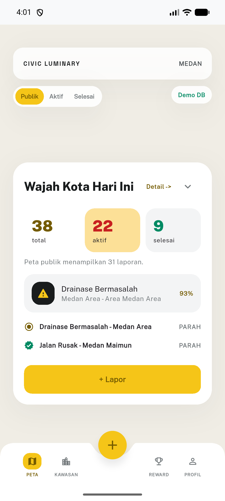
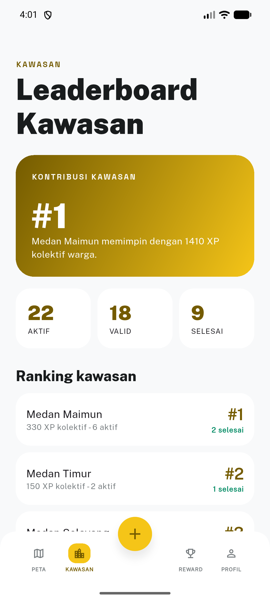

# SuaraMedan

SuaraMedan adalah aplikasi civic-tech untuk membantu warga Medan melaporkan masalah kota dengan foto, lokasi, validasi komunitas, peta, XP, dan reward lokal.

Source code proyek ini bersifat privat. Repositori publik ini hanya berisi overview, screenshot, dan tautan APK demo.

## Fitur Utama

- Lapor masalah kota dengan foto dan lokasi.
- AI Assist membantu membaca kategori dan tingkat urgensi.
- Validasi komunitas memakai 2 sinyal warga sebelum laporan dianggap tervalidasi.
- Peta menampilkan laporan valid dan selesai berdasarkan kawasan.
- XP, badge, dan reward lokal mendorong kontribusi berulang.
- Profil warga berisi ringkasan kontribusi, pengaturan akun, dan privasi data.

## Screenshot

## Demo APK

APK demo tersedia di GitHub Releases:

https://github.com/Darelrk/SuaraMedan/releases/tag/demo-apk-2026-05-04

Catatan:

- APK ini untuk demo Android, bukan build produksi Play Store.
- Aplikasi membutuhkan koneksi internet.
- Data demo dapat berubah mengikuti backend demo.

## Status

Proyek sedang berada pada tahap demo akhir. Fokus utama: alur laporan warga, AI Assist, validasi, peta kawasan, reward, dan profil akun.

## Kontak

Project owner: Darelrk

